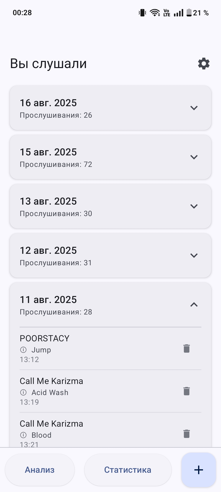
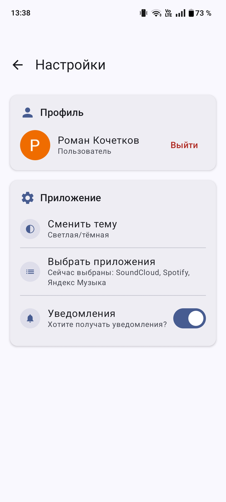

# Music Helper
### Приложение, помогающее собирать статистику, анализировать и давать рекомендации по прослушанной музыке

## Стек
#### Kotlin, Kotlin Coroutines
#### AI - Gemini Firebase AI Logic SDK
#### UI - Jetpack Compose, Material Design 3
#### Database - Room
#### DI - Koin
#### Auth - FirebaseUI (Google Auth)

## Скриншоты

